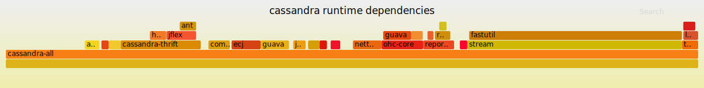

# deps-flamegraph

Converts the transitive dependencies of a java gradle project into a flame
graph. Allows to see the cumulated and relative size of all dependencies.

The `stackcollapse-gradle-dependencies.pl` script takes the output of 
`gradle dependencies` and converts it to a format accepted by flamegraph.pl

## Example

See included [example](https://github.com/pcdv/deps-flamegraph/tree/master/samples/cassandra) 
that computes the dependencies of Cassandra.



The file was generated by running `../../deps-flamegraph` under `samples/cassandra`.
```
$ ../../deps-flamegraph
Could not find flamegraph.pl, getting it from GitHub
Cloning into 'FlameGraph'...
Computing cassandra runtime dependencies. Set CONFIGURATION=test (or other) to use another configuration
Generated deps-runtime.svg
```

NB: the SVG is interactive but this does not work in GitHub (clone the project to see for yourself).

## Usage

Here are the options of the perl script, they can be used also with the `deps-flamegraph` script.

```
USAGE: stackcollapse-gradle-dependencies.pl [options] infile > outfile

  --org             # include dependency organisation
  --version         # include dependency version
  --no-size         # ignore jar size
  --jar-cache DIR   # specify alternate path for gradle jar cache

```

To generate test dependencies, run the following command:
 ```
 CONFIGURATION=testRuntime deps-flamegraph
 ```

