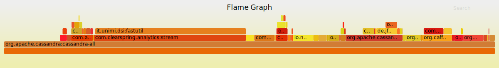

# deps-flamegraph

This is an experiment to see if flamegraphs can help analyzing dependencies
in (big) java projects. The size of the jars is taken into account to calculate
the width of each frame (instead of usual sample count).

The included perl script takes the output of `gradle dependencies` and converts
it to a format accepted by flamegraph.pl

## Usage
```
USAGE: stackcollapse-gradle-dependencies.pl [options] infile > outfile

  --org             # include dependency organisation
  --version         # include dependency version
  --no-size         # ignore jar size
  --jar-cache DIR   # specify alternate path for gradle jar cache

```

## Example

See included [example](https://github.com/pcdv/deps-flamegraph/tree/master/samples/cassandra) 
that computes the dependencies of Cassandra.



The commands used to generate the SVG are the following (supposing `flamegraph.pl` is in your $PATH).
```
./gradlew dependencies --configuration runtime | ../../stackcollapse-gradle-dependencies.pl --org > deps-collapsed
flamegraph.pl --countname KiB deps-collapsed  > deps-collapsed.svg
```

NB: the SVG is interactive but this does not work in GitHub (clone the project to see for yourself).


